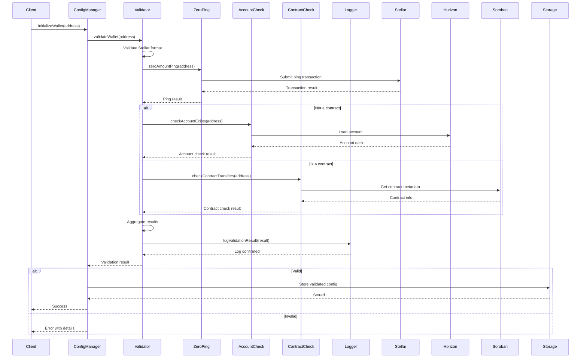

# Design Document: Platform Wallet Validation

## Overview

This feature adds validation for the platform wallet address to ensure safe fee collection. The platform wallet receives fees from escrow transactions, and if it's configured with an address that cannot receive funds (e.g., uninitialized account or contract that rejects transfers), all fee transfers will fail, potentially causing global escrow release failures.

The validation service will perform three key checks:

1. **Zero-Amount Ping**: Execute a test transaction to verify the address can receive funds
2. **Account Existence Check**: Verify the address corresponds to an existing account on the Stellar network
3. **Contract Transfer Check**: For contract addresses, verify the contract has a receive function that accepts payments

## Architecture

```
┌─────────────────────────────────────────────────────────────────────┐
│                        Platform Wallet Validation Service           │
├─────────────────────────────────────────────────────────────────────┤
│  ┌──────────────────┐  ┌──────────────────┐  ┌──────────────────┐  │
│  │  Zero-Amount     │  │  Account         │  │  Contract        │  │
│  │  Ping Validator  │  │  Existence       │  │  Transfer        │  │
│  │                  │  │  Validator       │  │  Validator       │  │
│  └──────────────────┘  └──────────────────┘  └──────────────────┘  │
│                              │                                      │
│                              ▼                                      │
│  ┌───────────────────────────────────────────────────────────────┐  │
│  │                    Validation Orchestrator                     │  │
│  │  - Coordinates validation sequence                             │  │
│  │  - Aggregates results and errors                               │  │
│  │  - Manages timeout and async behavior                          │  │
│  └───────────────────────────────────────────────────────────────┘  │
│                              │                                      │
│                              ▼                                      │
│  ┌───────────────────────────────────────────────────────────────┐  │
│  │                    Configuration Manager                       │  │
│  │  - Initialize validation                                       │  │
│  │  - Update validation                                           │  │
│  │  - Persistent storage                                          │  │
│  └───────────────────────────────────────────────────────────────┘  │
└─────────────────────────────────────────────────────────────────────┘
                              │
                              ▼
┌─────────────────────────────────────────────────────────────────────┐
│                        External Dependencies                        │
├─────────────────────────────────────────────────────────────────────┤
│  ┌──────────────────┐  ┌──────────────────┐  ┌──────────────────┐  │
│  │  Stellar Horizon │  │  Soroban RPC     │  │  Configuration   │  │
│  │  API             │  │  API             │  │  Storage         │  │
│  └──────────────────┘  └──────────────────┘  └──────────────────┘  │
└─────────────────────────────────────────────────────────────────────┘
```

## Components and Interfaces

### Validation Service

The core validation service that orchestrates all validation checks.

```typescript
interface ValidationService {
  /**
   * Perform complete validation of a platform wallet address
   * @param walletAddress - The Stellar address to validate
   * @param timeoutMs - Optional timeout in milliseconds (default: 5000)
   * @returns Validation result with status and error details
   */
  validateWallet(
    walletAddress: string,
    timeoutMs?: number,
  ): Promise<ValidationResult>;

  /**
   * Execute zero-amount ping to verify address can receive funds
   * @param walletAddress - The Stellar address to ping
   * @returns Ping result with success status
   */
  zeroAmountPing(walletAddress: string): Promise<PingResult>;

  /**
   * Check if the address corresponds to an existing account
   * @param walletAddress - The Stellar address to check
   * @returns Account existence result
   */
  checkAccountExists(walletAddress: string): Promise<AccountCheckResult>;

  /**
   * Check if a contract address can receive transfers
   * @param walletAddress - The contract address to check
   * @returns Contract transfer capability result
   */
  checkContractTransfers(walletAddress: string): Promise<ContractCheckResult>;
}
```

### Configuration Manager

Manages platform wallet configuration with validation integration.

```typescript
interface ConfigurationManager {
  /**
   * Initialize the platform wallet with validation
   * @param walletAddress - The initial wallet address
   * @returns Initialization result
   */
  initializeWallet(walletAddress: string): Promise<InitializationResult>;

  /**
   * Update the platform wallet with validation
   * @param newWalletAddress - The new wallet address
   * @returns Update result
   */
  updateWallet(newWalletAddress: string): Promise<UpdateResult>;

  /**
   * Get current platform wallet configuration
   * @returns Current configuration
   */
  getWalletConfig(): Promise<WalletConfig>;

  /**
   * Check if current wallet is valid
   * @returns Validation status
   */
  isWalletValid(): boolean;
}
```

### Data Structures

#### Validation Result

```typescript
interface ValidationResult {
  status: "valid" | "invalid" | "timeout" | "error";
  isValid: boolean;
  errors: ValidationError[];
  timestamp: number;
  validationDurationMs: number;
}

interface ValidationError {
  code: string;
  message: string;
  field?: string;
  details?: Record<string, unknown>;
}
```

#### Ping Result

```typescript
interface PingResult {
  success: boolean;
  error?: string;
  transactionHash?: string;
}
```

#### Account Check Result

```typescript
interface AccountCheckResult {
  exists: boolean;
  isUninitialized: boolean;
  error?: string;
}
```

#### Contract Check Result

```typescript
interface ContractCheckResult {
  isContract: boolean;
  canReceiveTransfers: boolean;
  hasReceiveFunction: boolean;
  error?: string;
}
```

#### Wallet Configuration

```typescript
interface WalletConfig {
  address: string;
  isValid: boolean;
  lastValidatedAt: number | null;
  validationStatus: "pending" | "valid" | "invalid" | "unknown";
  lastError?: string;
}
```

## Data Models

### Validation Log Entry

```typescript
interface ValidationLogEntry {
  id: string;
  walletAddress: string;
  timestamp: number;
  result: "success" | "failure" | "timeout";
  errors: ValidationError[];
  durationMs: number;
  validationType: "initialize" | "update" | "scheduled" | "on-demand";
  ipAddress?: string;
  userId?: string;
}
```

### Platform Wallet Configuration

```typescript
interface PlatformWalletConfig {
  address: string;
  isValid: boolean;
  lastValidatedAt: number | null;
  validationStatus: "pending" | "valid" | "invalid" | "unknown";
  lastError?: string;
  createdAt: number;
  updatedAt: number;
}
```

## Validation Flow

### Complete Validation Sequence

```
┌─────────────────────────────────────────────────────────────────────┐
│                    Complete Validation Flow                         │
├─────────────────────────────────────────────────────────────────────┤
│  1. Input: Wallet Address                                           │
│  2. Check if address is valid Stellar format                        │
│  3. Execute zero-amount ping                                        │
│  4. Check account existence (if not contract)                       │
│  5. Check contract transfer capability (if contract)                │
│  6. Aggregate results and determine validity                        │
│  7. Log validation result                                           │
│  8. Return validation result                                        │
└─────────────────────────────────────────────────────────────────────┘
```

### Validation Sequence Diagram



## Correctness Properties

_A property is a characteristic or behavior that should hold true across all valid executions of a system-essentially, a formal statement about what the system should do. Properties serve as the bridge between human-readable specifications and machine-verifiable correctness guarantees._

### Property 1: Validation determines address validity correctly

_For any_ valid Stellar address that can receive funds, the validation service SHALL return a valid status with no errors. _For any_ invalid Stellar address (uninitialized account, contract that rejects transfers, etc.), the validation service SHALL return an invalid status with appropriate error messages.

**Validates: Requirements 1.1, 1.2, 2.1, 2.2, 3.1, 3.2, 3.3, 4.1, 4.2, 4.3, 5.1, 5.2, 5.3**

### Property 2: Validation preserves existing configuration on failure

_For any_ platform wallet configuration, when a new address validation fails, the existing wallet address SHALL remain unchanged and the existing configuration SHALL be preserved.

**Validates: Requirements 1.3, 2.2, 6.3**

### Property 3: Validation logs all attempts for audit trail

_For any_ validation attempt (successful or failed), the validation service SHALL create a log entry with the wallet address, timestamp, result, and any error details.

**Validates: Requirements 6.2**

### Property 4: Validation completes within timeout

_For any_ validation request with a specified timeout, the validation service SHALL complete within that timeout or return a timeout error.

**Validates: Requirements 8.1, 8.3**

### Property 5: Zero-amount ping verifies fund receipt capability

_For any_ Stellar address, executing a zero-amount ping transaction that succeeds indicates the address can receive funds. A failed ping transaction indicates the address cannot receive funds.

**Validates: Requirements 3.1, 3.2, 3.3**

### Property 6: Account existence check detects uninitialized accounts

_For any_ Stellar address, checking account existence on the Stellar network correctly identifies whether the account is initialized. Non-existent accounts are identified as uninitialized.

**Validates: Requirements 4.1, 4.2, 4.3**

### Property 7: Contract transfer check verifies receive function

_For any_ contract address, checking contract transfer capability correctly identifies whether the contract has a receive function that accepts payments.

**Validates: Requirements 5.1, 5.2, 5.3**

### Property 8: Escrow operations check wallet validity

_For any_ escrow transaction processing, the payment service SHALL check that the platform wallet is configured and valid before attempting commission transfers.

**Validates: Requirements 7.1, 7.2, 7.3**

## Error Handling

### Error Codes

```typescript
enum ValidationErrorCode {
  INVALID_FORMAT = "INVALID_FORMAT",
  PING_FAILED = "PING_FAILED",
  ACCOUNT_NOT_FOUND = "ACCOUNT_NOT_FOUND",
  CONTRACT_REJECTS_TRANSFERS = "CONTRACT_REJECTS_TRANSFERS",
  NO_RECEIVE_FUNCTION = "NO_RECEIVE_FUNCTION",
  TIMEOUT = "TIMEOUT",
  NETWORK_ERROR = "NETWORK_ERROR",
  CONFIGURATION_ERROR = "CONFIGURATION_ERROR",
}
```

### Error Handling Strategy

1. **Format Validation**: Reject addresses that don't match Stellar address format
2. **Ping Failures**: Return descriptive errors for ping transaction failures
3. **Account Not Found**: Return specific error for uninitialized accounts
4. **Contract Issues**: Return specific errors for contracts that reject transfers
5. **Timeouts**: Return timeout errors with duration information
6. **Network Errors**: Return network errors with retry guidance
7. **Configuration Errors**: Return configuration errors for missing dependencies

### Error Response Format

```typescript
interface ErrorResponse {
  success: false;
  error: {
    code: ValidationErrorCode;
    message: string;
    details?: Record<string, unknown>;
    timestamp: number;
  };
}
```

## Testing Strategy

### Unit Tests

#### Validation Service Tests

```typescript
describe("ValidationService", () => {
  describe("zeroAmountPing", () => {
    it("should succeed for valid address", async () => {
      // Test that valid addresses pass ping
    });

    it("should fail for uninitialized account", async () => {
      // Test that uninitialized accounts fail ping
    });

    it("should fail for contract that rejects transfers", async () => {
      // Test that contracts rejecting transfers fail ping
    });

    it("should timeout for unresponsive addresses", async () => {
      // Test timeout behavior
    });
  });

  describe("checkAccountExists", () => {
    it("should return true for existing account", async () => {
      // Test existing account detection
    });

    it("should return false for non-existent account", async () => {
      // Test non-existent account detection
    });
  });

  describe("checkContractTransfers", () => {
    it("should return true for contract with receive function", async () => {
      // Test contract with receive function
    });

    it("should return false for contract without receive function", async () => {
      // Test contract without receive function
    });

    it("should return false for contract that rejects transfers", async () => {
      // Test contract rejecting transfers
    });
  });

  describe("validateWallet", () => {
    it("should return valid for fully valid address", async () => {
      // Test complete validation for valid address
    });

    it("should return invalid with errors for invalid address", async () => {
      // Test complete validation for invalid address
    });

    it("should aggregate multiple errors correctly", async () => {
      // Test error aggregation
    });
  });
});
```

#### Configuration Manager Tests

```typescript
describe("ConfigurationManager", () => {
  describe("initializeWallet", () => {
    it("should initialize with valid address", async () => {
      // Test successful initialization
    });

    it("should reject invalid address", async () => {
      // Test rejection of invalid address
    });

    it("should preserve existing config on failure", async () => {
      // Test config preservation on failure
    });
  });

  describe("updateWallet", () => {
    it("should update with valid address", async () => {
      // Test successful update
    });

    it("should reject invalid address", async () => {
      // Test rejection of invalid address
    });

    it("should preserve existing config on failure", async () => {
      // Test config preservation on failure
    });
  });
});
```

### Integration Tests

```typescript
describe("Integration Tests", () => {
  describe("Complete Validation Flow", () => {
    it("should validate a real Stellar address", async () => {
      // Test with real Stellar address on testnet
    });

    it("should detect uninitialized account", async () => {
      // Test with known uninitialized address
    });

    it("should detect contract that rejects transfers", async () => {
      // Test with known contract that rejects transfers
    });
  });

  describe("Escrow Integration", () => {
    it("should check wallet validity before commission transfer", async () => {
      // Test escrow commission flow with wallet validation
    });

    it("should log warning for invalid wallet", async () => {
      // Test warning logging for invalid wallet
    });
  });
});
```

### Property-Based Tests

```typescript
// Test Property 1: Validation determines address validity correctly
property(
  "validation determines address validity correctly",
  {
    generators: [stellarAddressGenerator, validationTypeGenerator],
    runs: 100,
  },
  async (address, validationType) => {
    const result = await validateWallet(address);

    if (isValidAddress(address)) {
      expect(result.isValid).toBe(true);
      expect(result.errors).toHaveLength(0);
    } else {
      expect(result.isValid).toBe(false);
      expect(result.errors).not.toHaveLength(0);
    }
  },
);

// Test Property 2: Validation preserves existing configuration on failure
property(
  "validation preserves existing configuration on failure",
  {
    generators: [walletConfigGenerator, invalidAddressGenerator],
    runs: 100,
  },
  async (existingConfig, invalidAddress) => {
    const result = await updateWallet(invalidAddress);

    expect(result.isValid).toBe(false);
    expect(result.config.address).toBe(existingConfig.address);
  },
);

// Test Property 3: Validation logs all attempts for audit trail
property(
  "validation logs all attempts for audit trail",
  {
    generators: [stellarAddressGenerator],
    runs: 100,
  },
  async (address) => {
    await validateWallet(address);

    const logs = await getValidationLogs(address);
    expect(logs).not.toHaveLength(0);
    expect(logs[0].walletAddress).toBe(address);
  },
);

// Test Property 4: Validation completes within timeout
property(
  "validation completes within timeout",
  {
    generators: [stellarAddressGenerator, timeoutGenerator],
    runs: 100,
  },
  async (address, timeout) => {
    const startTime = Date.now();
    const result = await validateWallet(address, timeout);
    const duration = Date.now() - startTime;

    expect(duration).toBeLessThanOrEqual(timeout + 1000); // Allow 1s buffer
  },
);
```

### Edge Cases

1. **Uninitialized Accounts**: Test with addresses that exist on chain but have no balance
2. **Contract Rejections**: Test with contracts that explicitly reject transfers
3. **Timeout Scenarios**: Test with very short timeouts to verify timeout handling
4. **Network Failures**: Test with mocked network failures
5. **Invalid Address Formats**: Test with malformed Stellar addresses
6. **Empty Address**: Test with empty string address
7. **Null/Undefined**: Test with null or undefined inputs
8. **Very Long Addresses**: Test with addresses exceeding normal length

### Test Configuration

- **Unit Tests**: 100+ iterations for property-based tests
- **Integration Tests**: 1-3 representative examples per scenario
- **Timeout**: 5 seconds maximum for validation
- **Mocking**: Use Jest mocks for external dependencies
- **Test Network**: Use Stellar testnet for integration tests

## Implementation Notes

### Key Design Decisions

1. **Sequential Validation**: Validation checks run sequentially to provide clear error messages and avoid race conditions
2. **Timeout Protection**: All validation operations have a configurable timeout (default 5 seconds)
3. **Error Aggregation**: Multiple validation errors are aggregated for comprehensive error reporting
4. **Async Support**: Validation can run asynchronously to avoid blocking configuration
5. **Logging**: All validation attempts are logged for audit and debugging purposes

### Performance Considerations

1. **Parallel Execution**: Account existence and contract checks could run in parallel for performance
2. **Caching**: Validation results could be cached for a short period
3. **Background Validation**: Validation could run in background after configuration
4. **Timeout Management**: Each validation step has its own timeout to prevent cascading delays

### Security Considerations

1. **Input Validation**: All inputs are validated for Stellar address format
2. **Error Sanitization**: Error messages are sanitized to prevent information leakage
3. **Rate Limiting**: Validation requests could be rate-limited to prevent abuse
4. **Audit Trail**: All validation attempts are logged for security auditing

## Dependencies

### External Dependencies

1. **Stellar Horizon API**: For account existence checks
2. **Soroban RPC API**: For contract metadata and transfer capability checks
3. **Stellar SDK**: For transaction building and address validation

### Internal Dependencies

1. **Configuration Service**: For storing and retrieving wallet configuration
2. **Logging Service**: For validation logging
3. **Wallet Service**: For wallet connection and transaction signing

## Deployment Considerations

1. **Environment Variables**: Configure Stellar network endpoints
2. **API Rate Limits**: Monitor and handle API rate limits
3. **Network Connectivity**: Ensure reliable network connectivity to Stellar nodes
4. **Backup Validation**: Consider backup validation methods for critical operations
5. **Monitoring**: Implement monitoring for validation failures and timeouts
