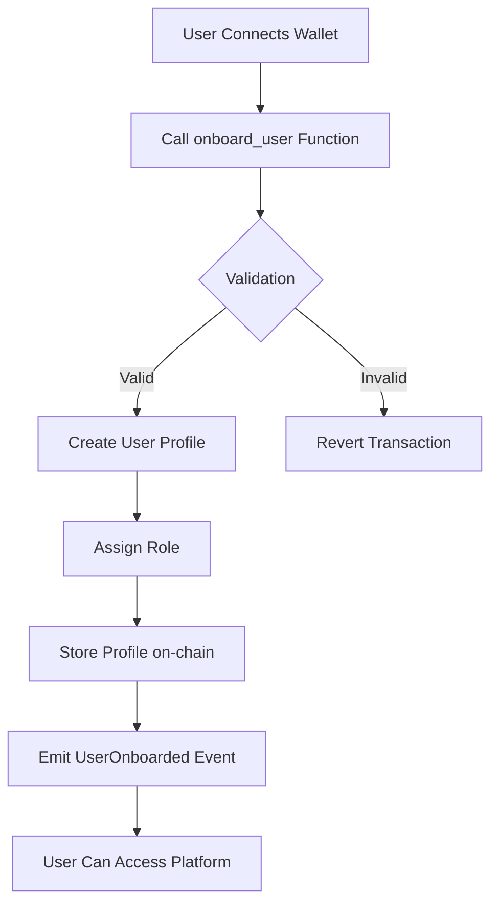
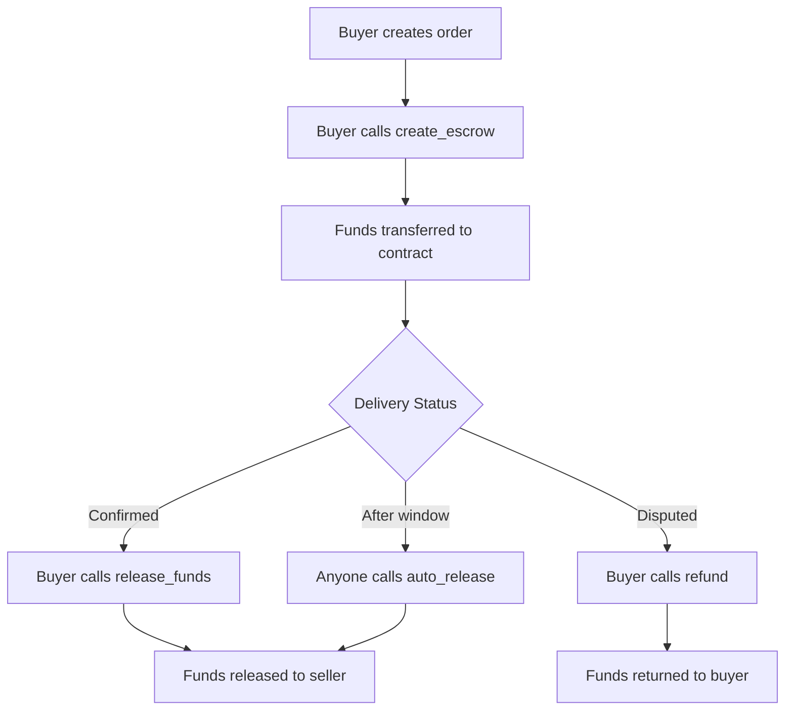

# CraftNexus Smart Contracts

Stellar Smart Contracts (Soroban) for the CraftNexus marketplace platform.

## Table of Contents

- [Overview](#overview)
- [Contracts](#contracts)
  - [Onboarding Contract](#onboarding-contract)
  - [Escrow Contract](#escrow-contract)
- [Prerequisites](#prerequisites)
- [Installation](#installation)
- [Building Contracts](#building-contracts)
- [Deployment](#deployment)
- [Contract Addresses](#contract-addresses)

---

## Overview

CraftNexus uses Stellar Soroban smart contracts to provide secure, decentralized functionality for the handmade marketplace platform. The system consists of two main contracts:

1. **Onboarding Contract** - Manages user registration, role assignment, and platform access
2. **Escrow Contract** - Handles secure payment holding for marketplace transactions

---

## Contracts

### Onboarding Contract

The Onboarding Contract manages user registration and role assignment for the CraftNexus platform. It provides a secure way for users to join the platform with specific roles that determine their permissions and capabilities.

#### Purpose

The onboarding contract solves several key problems within CraftNexus:

- **User Identity Management**: Establishes a verified user base with unique identities
- **Role-Based Access Control**: Assigns appropriate roles (Buyer/Artisan) to control platform capabilities
- **Platform Security**: Prevents unauthorized access and ensures only legitimate users can participate
- **Transparency**: Creates an auditable record of all platform participants

#### System Architecture

```
┌─────────────────────────────────────────────────────────────┐
│                    CraftNexus Platform                      │
├─────────────────────────────────────────────────────────────┤
│                                                               │
│  ┌──────────────┐    ┌──────────────────┐    ┌───────────┐  │
│  │    User      │───▶│ Onboarding       │───▶│  Role     │  │
│  │  (Wallet)    │    │   Contract       │    │ Assignment│  │
│  └──────────────┘    └──────────────────┘    └───────────┘  │
│                              │                     │          │
│                              ▼                     ▼          │
│                      ┌──────────────────┐    ┌───────────┐    │
│                      │  User Profile    │◀───│  Escrow   │    │
│                      │  Storage         │    │  Contract │    │
│                      └──────────────────┘    └───────────┘    │
│                                                               │
└─────────────────────────────────────────────────────────────┘
```

#### User Roles

The platform supports four user roles:

| Role | Description | Capabilities |
|------|-------------|--------------|
| `None` | User has not onboarded | No platform access |
| `Buyer` | Standard customer | Browse, purchase, create orders |
| `Artisan` | Seller/crafter | Create listings, receive payments, manage shop |
| `Admin` | Platform administrator | Verify users, manage roles, platform settings |

---

### Onboarding Contract Functional Flow

#### Complete Onboarding Lifecycle



#### Onboarding Steps

1. **User connects wallet** - User authenticates with their Stellar wallet (Freighter, Albedo, etc.)
2. **User calls `onboard_user` function** - Initiates the registration process
3. **Contract validates requirements** - Checks username, role, and existing registration
4. **Contract updates user state** - Creates profile with assigned role
5. **Events are emitted** - `UserOnboarded` event signals successful registration

---

### Onboarding Contract Functions

#### `initialize`

Initialize the onboarding contract with an administrator.

**Description:** Sets up the contract configuration and assigns the platform admin.

**Parameters:**
- `admin (address)` – Wallet address of the platform administrator

**Behavior:**
- Stores contract configuration
- Assigns admin role to the specified address
- Creates initial admin profile

**Reverts if:**
- Contract already initialized

**Example CLI interaction:**
```bash
stellar contract invoke \
  --id <ONBOARDING_CONTRACT_ID> \
  --source <ADMIN_SECRET> \
  --network testnet \
  -- \
  initialize \
  --admin GXXXX...XXXX
```

---

#### `onboard_user`

Register a new user on the CraftNexus platform.

**Description:** Creates a new user profile with the specified role (Buyer or Artisan).

**Parameters:**
- `user (address)` – User's wallet address
- `username (string)` – Desired username (3-50 characters)
- `role (u32)` – Desired role (1 = Buyer, 2 = Artisan)

**Behavior:**
- Validates user authentication
- Checks username length requirements (3-50 characters)
- Ensures user is not already onboarded
- Creates user profile with specified role
- Emits `UserOnboarded` event

**Reverts if:**
- User already onboarded
- Username too short (< 3 characters)
- Username too long (> 50 characters)
- Invalid role specified (not Buyer or Artisan)

**Example CLI interaction:**
```bash
# Onboard as a buyer
stellar contract invoke \
  --id <ONBOARDING_CONTRACT_ID> \
  --source <USER_SECRET> \
  --network testnet \
  -- \
  onboard_user \
  --user GXXXX...XXXX \
  --username "artisan_jane" \
  --role 2

# Onboard as a buyer  
stellar contract invoke \
  --id <ONBOARDING_CONTRACT_ID> \
  --source <USER_SECRET> \
  --network testnet \
  -- \
  onboard_user \
  --user GXXXX...XXXX \
  --username "buyer_john" \
  --role 1
```

**Example TypeScript interaction:**
```typescript
import { Contract } from 'stellar-sdk';

const onboardingContract = new Contract(ONBOARDING_CONTRACT_ID);

const result = await onboardingContract.invoke({
  method: 'onboard_user',
  args: [
    addressToSCVal(userAddress, 'address'),
    addressToSCVal(username, 'string'), 
    uint32ToSCVal(2) // UserRole::Artisan
  ]
});
```

---

#### `get_user`

Retrieve user profile information.

**Description:** Fetches the complete user profile for a given address.

**Parameters:**
- `user (address)` – User's wallet address

**Returns:**
- `UserProfile` struct containing:
  - `address` - User's wallet address
  - `role` - User's role (0=None, 1=Buyer, 2=Artisan, 3=Admin)
  - `username` - User's username
  - `registered_at` - Unix timestamp of registration
  - `is_verified` - Verification status

**Reverts if:**
- User not found (not onboarded)

**Example CLI interaction:**
```bash
stellar contract invoke \
  --id <ONBOARDING_CONTRACT_ID> \
  --source <USER_SECRET> \
  --network testnet \
  -- \
  get_user \
  --user GXXXX...XXXX
```

---

#### `get_user_role`

Get user's current role.

**Description:** Returns the role assigned to a user without fetching the full profile.

**Parameters:**
- `user (address)` – User's wallet address

**Returns:**
- `u32` - Role value (0=None, 1=Buyer, 2=Artisan, 3=Admin)

**Example CLI interaction:**
```bash
stellar contract invoke \
  --id <ONBOARDING_CONTRACT_ID> \
  --network testnet \
  -- \
  get_user_role \
  --user GXXXX...XXXX
```

---

#### `is_onboarded`

Check if user has completed onboarding.

**Description:** Quick check to determine if a wallet address has registered on the platform.

**Parameters:**
- `user (address)` – User's wallet address

**Returns:**
- `bool` - true if user is onboarded, false otherwise

**Example CLI interaction:**
```bash
stellar contract invoke \
  --id <ONBOARDING_CONTRACT_ID> \
  --network testnet \
  -- \
  is_onboarded \
  --user GXXXX...XXXX
```

---

#### `update_user_role`

Update user's role (Admin only).

**Description:** Allows the platform administrator to change a user's role.

**Parameters:**
- `user (address)` – User's wallet address to update
- `new_role (u32)` – New role to assign (0=None, 1=Buyer, 2=Artisan, 3=Admin)

**Behavior:**
- Validates caller is the platform admin
- Updates the user's role
- Emits `RoleUpdated` event

**Reverts if:**
- Caller is not the platform administrator
- User not found

**Example CLI interaction:**
```bash
stellar contract invoke \
  --id <ONBOARDING_CONTRACT_ID> \
  --source <ADMIN_SECRET> \
  --network testnet \
  -- \
  update_user_role \
  --user GXXXX...XXXX \
  --new_role 3
```

---

#### `verify_user`

Verify a user (Admin only).

**Description:** Allows the platform administrator to verify a user, granting them additional trust.

**Parameters:**
- `user (address)` – User's wallet address to verify

**Behavior:**
- Validates caller is the platform admin
- Sets user's verification status to true
- Emits `UserVerified` event

**Reverts if:**
- Caller is not the platform administrator
- User not found

**Example CLI interaction:**
```bash
stellar contract invoke \
  --id <ONBOARDING_CONTRACT_ID> \
  --source <ADMIN_SECRET> \
  --network testnet \
  -- \
  verify_user \
  --user GXXXX...XXXX
```

---

#### `has_role`

Check if user has a specific role.

**Description:** Efficiently check if a user has a particular role.

**Parameters:**
- `user (address)` – User's wallet address
- `role (u32)` – Role to check

**Returns:**
- `bool` - true if user has the specified role

**Example CLI interaction:**
```bash
stellar contract invoke \
  --id <ONBOARDING_CONTRACT_ID> \
  --network testnet \
  -- \
  has_role \
  --user GXXXX...XXXX \
  --role 2
```

---

### Onboarding Contract Events

The contract emits the following events for tracking:

| Event | Description | Data Emitted |
|-------|-------------|--------------|
| `UserOnboarded` | User successfully registers | `(user_address, username, role)` |
| `RoleUpdated` | User role changes | `(user_address, old_role, new_role)` |
| `UserVerified` | User verification status changed | `(user_address)` |

---

### Onboarding Contract Access Control

| Function | Access Level |
|----------|--------------|
| `initialize` | Contract deployer only |
| `onboard_user` | Any wallet (self-registration) |
| `get_user` | Public |
| `get_user_role` | Public |
| `is_onboarded` | Public |
| `has_role` | Public |
| `update_user_role` | Platform admin only |
| `verify_user` | Platform admin only |
| `get_config` | Public |

---

### Onboarding Contract Validation Rules

- **Username length**: 3-50 characters
- **Allowed roles for self-registration**: Buyer (1), Artisan (2)
- **Admin role**: Can only be assigned by existing admin
- **One profile per wallet**: Each wallet address can only onboard once

---

### Escrow Contract

The Escrow Contract handles secure payment holding for marketplace transactions.

#### Purpose

The escrow contract solves critical payment challenges in the CraftNexus marketplace:

- **Secure Payment Holding**: Buyer funds are held securely until delivery is confirmed
- **Automatic Release**: Funds automatically release after a configurable time window
- **Dispute Resolution**: Refund functionality for handling disagreements
- **Platform Trust**: Builds trust between buyers and artisans

#### Functional Flow



#### Contract Functions

##### `create_escrow`

Create a new escrow for an order.

**Parameters:**
- `buyer`: Buyer's Stellar address
- `seller`: Seller's Stellar address  
- `token`: Token contract address (USDC)
- `amount`: Amount in stroops (1 USDC = 10,000,000 stroops)
- `order_id`: Unique order identifier
- `release_window`: Time in seconds before auto-release (default: 604800 = 7 days)

##### `release_funds`

Release funds to seller (called by buyer after delivery confirmation).

**Parameters:**
- `order_id`: Order identifier

##### `auto_release`

Auto-release funds after release window (seller can call).

**Parameters:**
- `order_id`: Order identifier

##### `refund`

Refund funds to buyer (for disputes).

**Parameters:**
- `order_id`: Order identifier
- `authorized_address`: Address authorized to refund

##### `get_escrow`

Get escrow details.

**Parameters:**
- `order_id`: Order identifier

##### `can_auto_release`

Check if escrow can be auto-released.

**Parameters:**
- `order_id`: Order identifier

---

## Prerequisites

- Rust 1.70.0 or later
- Stellar CLI (installation instructions below)
- Stellar account with testnet XLM (for deployment)

## Quick Start

### 1. Install Stellar CLI

Run the automated installation script:

```bash
./scripts/install-stellar-cli.sh
```

This will:
- Install Stellar CLI with optimizations
- Verify the installation
- Ensure WASM target is configured

**Manual Installation (Alternative):**
```bash
cargo install --locked stellar-cli
rustup target add wasm32-unknown-unknown
```

---

## Building Contracts

### Build All Contracts

```bash
./scripts/build.sh
```

Or manually:
```bash
stellar contract build
```

This will create WASM files:
- **Onboarding**: `target/wasm32-unknown-unknown/release/craft_nexus_onboarding.wasm`
- **Escrow**: `target/wasm32-unknown-unknown/release/craft_nexus_escrow.wasm`

### Build Specific Contract

```bash
# Build onboarding contract
stellar contract build --package onboarding

# Build escrow contract  
stellar contract build --package escrow
```

---

## Deployment

### Prerequisites

- [Stellar CLI](https://developers.stellar.org/docs/build/smart-contracts/getting-started/setup#install-the-stellar-cli) installed.
- A Stellar account with testnet/mainnet funds.

### Required Secrets

To deploy contracts, you will need:
- **Source Account Secret Key**: The private key of the account that will deploy and pay for the contract. Keep this secret!

### Automated Deployment (Recommended)

A deployment script is provided in the frontend repository:

```bash
./scripts/deploy.sh [testnet|mainnet] <YOUR_IDENTITY_NAME>
```

Example:
```bash
# Deploy to testnet using identity 'alice'
./scripts/deploy.sh testnet alice

# Deploy to mainnet using identity 'mainnet-deployer'
./scripts/deploy.sh mainnet mainnet-deployer
```

The script will:
1. Build the contracts
2. Deploy the WASM files to the specified network
3. Output the new Contract IDs
4. Provide the environment variable entries for the frontend

### Manual Deployment

#### 1. Setup Network

**Testnet:**
```bash
stellar network add --rpc-url https://soroban-testnet.stellar.org:443 --network-passphrase "Test SDF Network ; September 2015" testnet
```

**Mainnet:**
```bash
stellar network add --rpc-url https://soroban-rpc.mainnet.stellar.org:443 --network-passphrase "Public Global Stellar Network ; September 2015" mainnet
```

#### 2. Deploy Onboarding Contract

```bash
# Build
stellar contract build

# Deploy onboarding contract
stellar contract deploy \
  --wasm target/wasm32-unknown-unknown/release/craft_nexus_onboarding.wasm \
  --source <YOUR_IDENTITY_NAME_OR_SECRET_KEY> \
  --network testnet
```

#### 3. Deploy Escrow Contract

```bash
stellar contract deploy \
  --wasm target/wasm32-unknown-unknown/release/craft_nexus_escrow.wasm \
  --source <YOUR_IDENTITY_NAME_OR_SECRET_KEY> \
  --network testnet
```

#### 4. Initialize Onboarding Contract

After deploying the onboarding contract, initialize it:

```bash
stellar contract invoke \
  --id <ONBOARDING_CONTRACT_ID> \
  --source <YOUR_IDENTITY_NAME_OR_SECRET_KEY> \
  --network testnet \
  -- \
  initialize \
  --admin <ADMIN_ADDRESS>
```

#### 5. Update Environment Variables

After deployment, copy the returned Contract IDs and add to your frontend `.env.local`:

```
NEXT_PUBLIC_ONBOARDING_CONTRACT_ADDRESS=<ONBOARDING_CONTRACT_ID>
NEXT_PUBLIC_ESCROW_CONTRACT_ADDRESS=<ESCROW_CONTRACT_ID>
```

---

## Testing Contracts

### Run All Tests

```bash
cd craft-nexus-contract
cargo test
```

### Run Specific Contract Tests

```bash
# Test onboarding contract
cargo test --lib onboarding

# Test escrow contract
cargo test --lib test
```

---

## Integration

See [`craft-nexus/lib/stellar/contracts.ts`](../craft-nexus/lib/stellar/contracts.ts) for TypeScript integration examples.

### Frontend Integration Example

```typescript
// Check if user is onboarded
const isOnboarded = await onboardingContract.invoke({
  method: 'is_onboarded',
  args: [addressToSCVal(walletAddress, 'address')]
});

// Onboard as artisan
await onboardingContract.invoke({
  method: 'onboard_user',
  args: [
    addressToSCVal(walletAddress, 'address'),
    addressToSCVal('artisan_username', 'string'),
    uint32ToSCVal(2) // UserRole::Artisan
  ]
});

// Get user role
const role = await onboardingContract.invoke({
  method: 'get_user_role', 
  args: [addressToSCVal(walletAddress, 'address')]
});
```

---

## Contract Addresses

### Testnet

- **Onboarding Contract**: `[DEPLOY_AND_UPDATE]`
- **Escrow Contract**: `[DEPLOY_AND_UPDATE]`

### Mainnet

- **Onboarding Contract**: `[DEPLOY_AND_UPDATE]`
- **Escrow Contract**: `[DEPLOY_AND_UPDATE]`

---

## Security Considerations

1. **Admin Key Management**: The platform admin has significant privileges - store the admin key securely
2. **User Validation**: Always verify user roles before allowing sensitive operations
3. **Token Handling**: Only use verified token addresses for escrow transactions
4. **Release Windows**: Choose appropriate release windows balancing buyer protection and seller cash flow

---

## Troubleshooting

### Common Issues

**"Contract not initialized"**
- Ensure the onboarding contract has been initialized with `initialize`

**"User already onboarded"**
- Each wallet can only onboard once; use a different wallet address

**"Username too short/long"**
- Username must be between 3-50 characters

**"Invalid role"**
- Only Buyer (1) and Artisan (2) roles can be self-assigned

---

## Additional Resources

- [Stellar Soroban Documentation](https://developers.stellar.org/docs/build/smart-contracts/overview)
- [Stellar CLI Reference](https://developers.stellar.org/docs/tools/stellar-cli)
- [CraftNexus Frontend Integration](./../craft-nexus/lib/stellar/contracts.ts)
